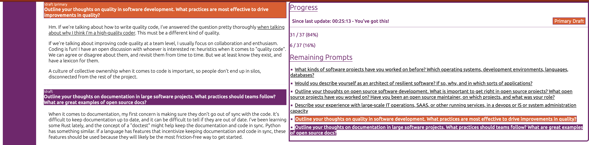

# Welcome to my response to  Canonical's written interview!

You will find some crazy systems I made to answer the prompts in order to make writing them a little more fun. I know it's overkill, but I wanted to try out some new stuff.

Were these the best technologies to use while writing a document? Definitely. This is the first time such software has been written.

This repo is forked from my resume generating repo, which I will refrain from linking to in an effort to try to keep this this written portion anonymous.

The primary purpose of this repo is to write the prompts sent to me by Canonical. It can, however, be used to answer any prompt set. This is a one-off repo. But since you're here, let me show you around!


## What is this, besides answers to prompts?
I'm glad you asked! I didn't think anybody would ever see this code but me. But since you're curious:

This repo can help navigate around the prompts as you answer them. You can answer prompts in any order, and keep track of:
* prompts you have answered
* prompts you haven't answered
* prompts that are in "draft form"
  - I found myself thinking about _some_ information that I wanted to record related to a prompt, but I wanted to make sure I didn't count it as completed just because there was some text below the prompt.

The answers to prompts are written in Markdown, to allow for some formatting and linking.

You can also easily link to other areas of the document to tie concepts together.
I also wrote it to help encourage me to keep writing - I needed it, at times.

Below is an example of what 'edit mode' looks like:


On the right, it lists all the prompts you haven't answered yet, as well as 'drafts'. Clicking on the name of any prompt will take you there, and you'll stay there even when the page refreshes.
Drafts are prompts that have `draft: [ true | primary ]` in the prompt object in `message.yaml`. The system will highlight prompts that are in draft form in bright colors. To make them easier to find while scrolling around.

In the image above, the orange highlighted one is the "primary draft". All that means is that the 'Primary Draft' button on the upper-right side will take you to the primary draft. And also that tacking on `#draft` to the url, so it looks like `localhost:8080#draft` will always take you to the current primary draft.


Once a prompt has an answer and doesn't have a `draft` key, it is considered done. Ideally this would be an explicit state with something like `done: true`, but I was lazy and making the system backwards-compatible with answers I wrote that didn't have the concept of drafts.


If you go through the history, you'll see me slowly converging on to this solution.

## How to use this repo

To run the system you should execute `./scripts/run.sh` Shocking, I know. If you want to run the whole thing, you'll need `fish`, `yq`, and `npm`. Not everything these scripts do are necessary - this was written just for me.

Once it's running, you can go to `localhost:8080` and see the rendered document there, presented as the PDF printer will see it. If you append a `edit=true` as a query param, you'll end up in (big surprise) "edit mode". Like this: `localhost:8080?edit=true`.

After you enter edit mode, the state is stored in localStorage, so you'll have to set `edit=false` as a query param if you want to get out of it.

The content is stored in `./messages/message.yaml`, because I wasn't sure what I was making yet. The file contains all your prompts and responses. It's format is the following:
```yaml
  main:
    - title: Identity and Authorization Technology
      prompts:
      - prompt: Describe your experience with authorization systems, specifically Open Policy Agent and OAuth.
        answers:
        - response: |
            your answer here
```

The key "main" is an array of question categories, as given to me by Canonical. Each category has an array of prompts. Each prompt has a (unfortunately named) "prompt" key, containing the prompt, and an "answers" key, which is an array containg the answers to the prompt.

Answers are in Markdown format. Answers are an array, rather than a string, so I can do some formatting with the figures. The contents of the answer objects `response` is where the text for the response goes.

The system helps out a little bit in that it creates anchor tags from the section and question names that are based off of the text of the prompt or section. This allows us to link to other questions of sections of the document easily.

For example, the prompt "Would you describe yourself as a high quality coder? Why?" has this id once rendered in html:  `would-you-describe-yourself-as-a-high-quality-coder--why-`

This lets me link to that prompt anywhere else I'm writing markdown via the usual syntax:
```markdown
  [Am I a high-quality coder?](#would-you-describe-yourself-as-a-high-quality-coder--why)
```

You can add a figure to any part of an answer by using this syntax:
```yaml
  figure:
    figure: naive-cluster-overview
    miro: '3458764548628056239'
```
You'll notice that there is a tightly-coupled relationship between figures and elements in a Miro board. This was intentional, and actually took longer than just copying and pasting the link to an object on the board. But I think it's cool to click on a figure and be taken to the latest version of that figure. And I also like people to look around my Miro boards as I use them, in case they're interested in my process.
I considered Miro diagrams to be a constrained, simplified form of information in the same way that the Markdown is.
### Tech Stack

#### Preact
I didn't want a build step, so I could avoid webpack and it's associated complexity. Instead, I decided to try out [Preact](https://preactjs.com/), which is similar to React, but using pure javascript and can be imported via a cdn! It can also emulate React if you want to use a build step, but I don't know why you'd do that.

#### YAML
I'm usually not a huge fan, but It's definitely nicer than writing JSON by hand.

#### Styles
I wanted to try out grid, so I used [CSS Grid](https://developer.mozilla.org/en-US/docs/Web/CSS/CSS_Grid_Layout) for the layout. I also wanted to try out [CSS Variables](https://developer.mozilla.org/en-US/docs/Web/CSS/Using_CSS_variables) for the colors, so I did that too.
